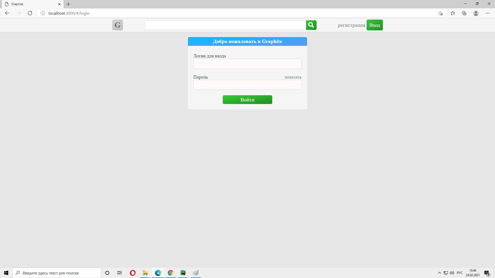

# Graphite_client

Это клиентская (frontend) часть приложения Graphite. О серверной части я 
рассказываю [вот тут](https://github.com/SergeyLebidko/Graphite_server/blob/master/README.md).

В последнее время я занимался изучением фреймворка React, писал простые компоненты,
тестировал отдельные аспекты их работы на отдельных web-страницах. Создал для этого 
даже учебный [репозиторий](https://github.com/SergeyLebidko/ReactTraining). 
Но мне захотелось проверить себя, написав с нуля проект, представляющий собой цельное 
web-приложение (к тому же разбитое на полноценные серверную и клиентскую часть ), а не 
набор не связанных друг с другом страниц с компонентами. Оно не должно было быть слишком
уж простым и тривиальным, но и не должно быть чрезмерно сложным. Я остановился на платформе
блогов. Посетители сайта могут просматривать аккаунты, посты и комментарии зарегистрированных
пользователей. Зарегистрированные пользователи могут сами создавать контент - писать посты,
оставлять комментарии, ставить лайки.

Название проекта - Graphite - выбрал совершенно произвольно. Просто первое, что прило в голову, когда
я подумал о том, как мог бы называться подобный сайт. 

Разрабатывая проект я обкатал разбиение интерфейса на отдельные компоненты, передачу свойств
вглубь по дереву компонентов, применение свойств по умолчанию (default props), применение обратных 
вызовов для изменения состояния вышестоящих компонентов, использование css-модулей, 
использование роутера (react-router).

Компоненты распределил по папкам в зависимости от их назначения. Если компонеты используются
только на одной странице, то я помещал их в соответствующую этой странице папку: например,
все компоненты страницы аккаунта находятся в папке account_page_components. Компоненты, используемые 
на нескольких страницах (к примеру, кнопки) я поместил в папку "общих" компонентов - common_components.
Такое распределение мне показалось наиболее логичным.

Отдельные параметры, используемые всеми компонентами приложения я собрал в специальных файлах расположенных
в корне проекта: settings.js (адреса точек api) и internal_pages.js (адреса страниц приложения используемые роутером).
Общие функции расположил в файле utils.js.

Для запуска проекта необходимо клонировать его репозиторий: 

```git clone https://github.com/SergeyLebidko/graphite_client.git```  

Затем выполнить установку зависимостей:

```npm install```

Если нужно, то в файле settings.js изменить адрес сервера api (он находится в самой первой строке):

```javascript
export const HOST = 'http://127.0.0.1:8000';
```

Затем выполнить ```npm run start```, чтобы запустить проект на тестовом сервере, либо ```npm run build```,
чтобы собрать проект для запуска, например, на nginx.

Сейчас в БД зарегистрированно несколько тестовых пользователей (я, как обычно использую имена супергероев):
```
adam
aquamen
hulk
batman
vader
bond
jason
ironman
superman
loki
sara
cap
thanos
tor
```
Пароль для всех один и тот же: ```Rd123456789/*-```

В заключение небольшое замечание по используемым библиотекам и инструментам. Пока что я не использую SASS или другие
препроцессоры CSS, но планирую начать это делать в ближайшее время. И для выполнения AJAX-запросов я использую знакомую
мне библиотеку jQuery. Знаю, что можно было использовать axios или fetch-api, но я привык к jQuery в этой части и, так
как это, все-таки, pet-проект, то я считаю, что могу позволить себе такую вольность :)

Ниже - скриншоты отдельных страниц проекта.

Главная страница сайта (выводится список последних постов):


Страинцы регистрации и входа:




Меню сайта для незарегистрированных пользователей:


Страница зарегистрированного пользователя, на которой он может редактировать настройки аккаунта или изменить аватар (для
этого ему просто нужно щелкнуть на самом аватаре и выбрать jpg-файл с новым аватаром на компьютере):


Непосредственно под аватаром отображается статистика пользователя: количество его постов, количество просмотров его 
постов, количество комментариев и лайков под его постами:


Меню для зарегистрированного пользователя:


Страница создания нового поста:


Страница со списком зарегистрированных авторов:


Страница просмотра информации о другом авторе (элементы управления в таком случае отключены: очевидно, чтобы невозможно 
было редактировать личные данные другого человека):


Страницы с результатами поиска постов и авторов:


Страница для просмотра поста с возможностью комментирования:

 